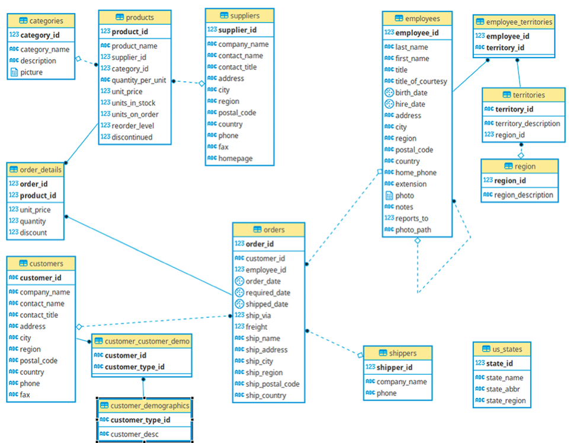

# Northwind ETL

The Northwind database is a sample database created by Microsoft contains the sales data for Northwind Traders Company, which imports and exports specialty foods from around the world.
You can get the database from this link:
https://docs.yugabyte.com/latest/sample-data/northwind/#explore-the-northwind-database

## Objective
The purpose of this project is to retrieve sales data from a transactional database that will be used for company analysis needs. Therefore, in this case, a simple ETL is made from the transactional database into Bigquery as Data Warehouse. Data transformed into a single-table design for faster-retrieving data to analytics needs.

## The Entity Relationship Diagram (ERD) of Northwind Database

src: yugabyte.com

## Implementation
1. Connect to PostgreSQL using sqlalchemy
2. Create a SQL query file that contains combining several tables and selects attributes related to sales data. The query results are stored in the dataframe and data type validation is performed.
3. Construct bigquery client object and create schema
4. Load dataframes into Bigquery

## Implementation Query SQL
1. Select table and their attribute to joined: 
  a. Orders: order_id, customer_id, order_date, required_date, shipped_date, ship_via, ship_country, freight
  b. Order details: unit_price, quantity, discount 
  c. Customers: company_name
  d. Products: product_name, product_id
  e. Categories: category_name

2. Filter sales data last month by order date. For example, today is February 2022, then the retrieved data is January 2022 data.

## Results: Orders table in Bigquery

